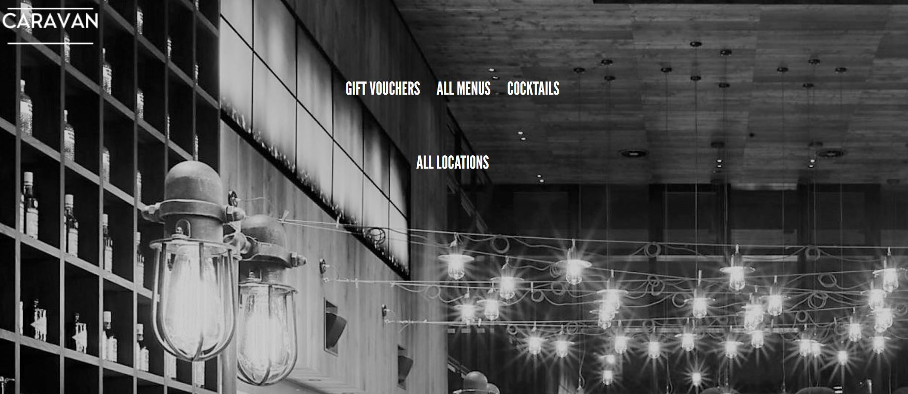
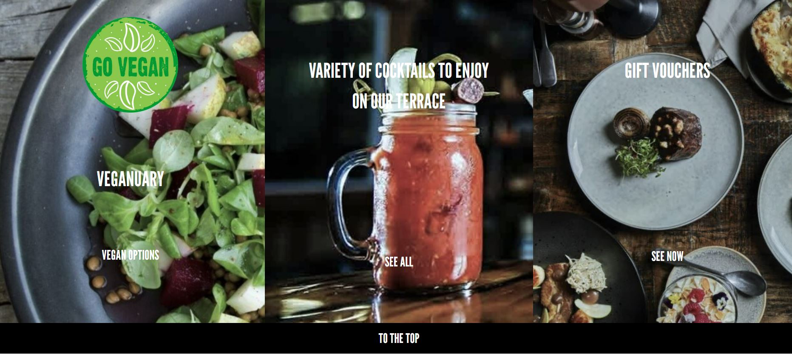
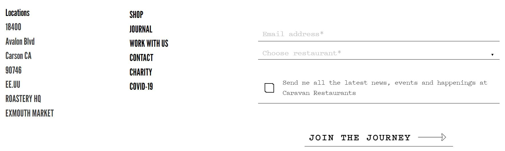
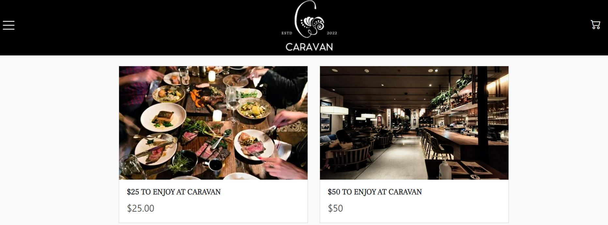
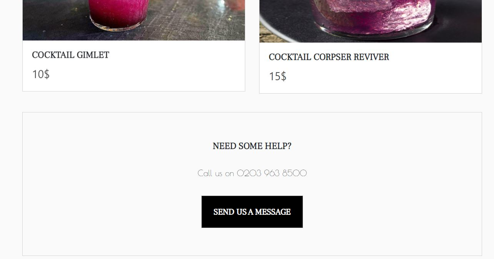
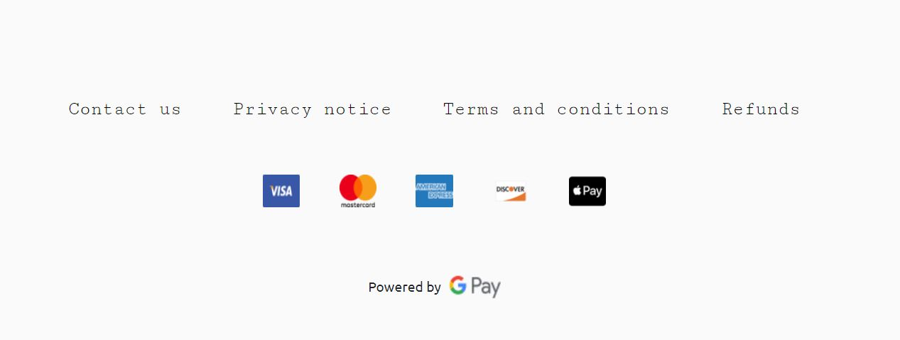
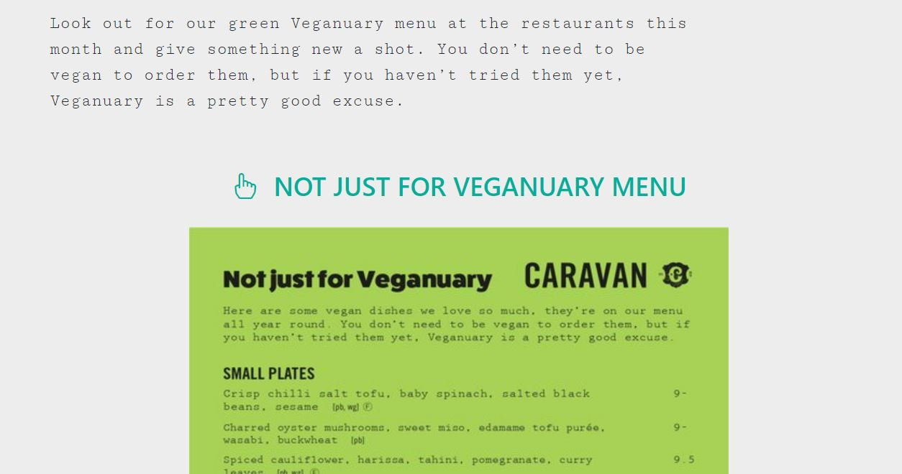
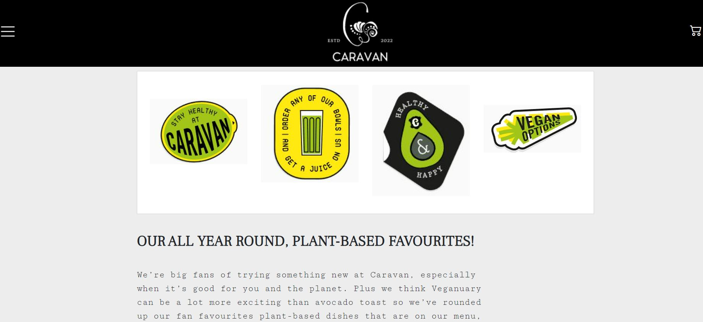

# Landing page Caravan

## Índice
1. Descripción del proyecto

2. Estado del proyecto

3. Características de la aplicación y demostración

4. Acceso al proyecto

5. Tecnologías utilizadas

6. Personas Contribuyentes

7. Personas-Desarrolladores del Proyecto

8. Licencia

9. Conclusión
  
### Descripción del proyecto
Proyecto desarrollado para la segunda entrega de proyectos del bootcamp geekshubsacademy el cual consiste en la realización de una Landing page de un restaurante con diferentes apartados como el de menú, localización, cocteles y vales de descuento.

Pagina web completamente funcional con navegación fluida por sus diferentes páginas y menús.
|Entrada a la pàgina principal|Imagenes con link de acceso| Formulario de información|
|-|-|-|
||| |

|Página vouchers|Botón de suscripción| Metodos de pago|
|-|-|-|
||| |

|Formulario de suscripción|Link al veganuary en pdf| Logos del veganuary con texto|
|-|-|-|
||| |

### Estado del proyecto
Proyecto Finalizado.
### Características de la aplicación y demostración
Funcionalidad 1: Posibilidad de navegación por las secciones con imagenes de la pantalla principal.

Funcionalidad 2: Formularios de suscripción o de demanda de información en todas las paginas.

Funcionalidad 3: Menús desplegables con links de acceso a otras secciones. 

Funcionalidad 4: Diseño totalmente responsive en todas las paginas de la lading page.

Funcionalidad 5: Posibilidad de descargar el archivo veganuary de la la pagina de menus asi como link de acceso para su mejor visualización.
### Acceso al proyecto
https://github.com/solsona1008/asm.geekshubs-fsd-val-Landing-Page-30-01-23-
### Tecnologías utilizadas
* HTML 5
* CSS
* BOOTSTRAP
* JS (scripts para bootstrap)
### Personas Contribuyentes
Usuario de github: solsona1008 (único contribuyente al proyecto).
### Licencia
MIT License
### Conclusión
Se logró plantear y elaborar el objetivo propuesto de la creación de una landing con ciertas funcionalidades en un periodo de tiempo concreto. En él se abordaron los principales aspectos del proyecto como que todas las pàginas se realizara mediante las tecnologías de HTML, CSS y especialmente BOOTSRAP, fueran totalmente responsive, asi como que cuente con formularios de registro localización y las diferentes secciones que aparecen en la página y las diferentes funcionalidades de la misma, como menus desplegables, links de acceso, contenido descargable y correcto funcionamiento de los formularios.

Se logró identificar los principales problemas de diseño responsive, y abordarlos de manera adecuada para que estuviesen correctamente ejecutadas todas las funcionalidades previstas en el diseño base del proyecto.
